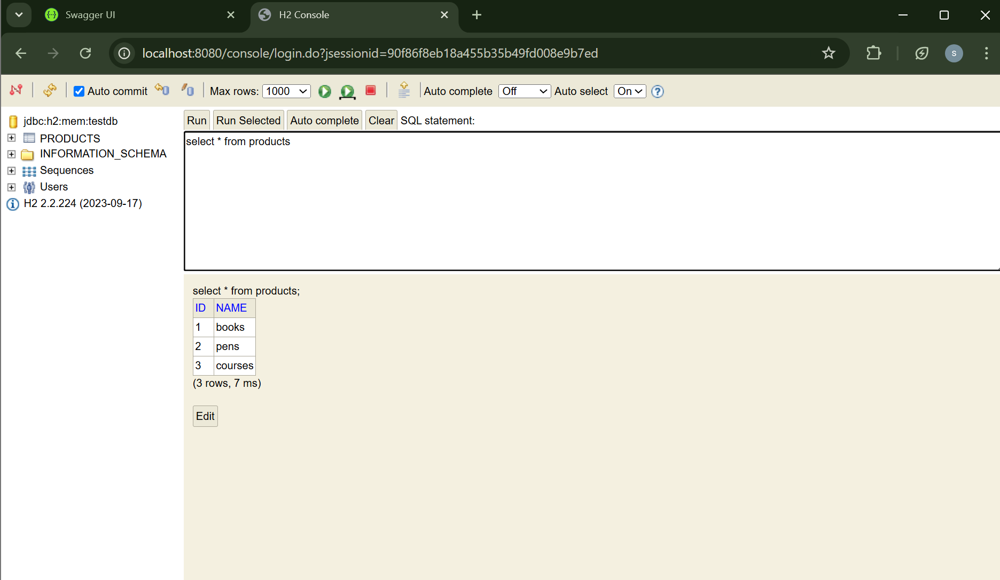
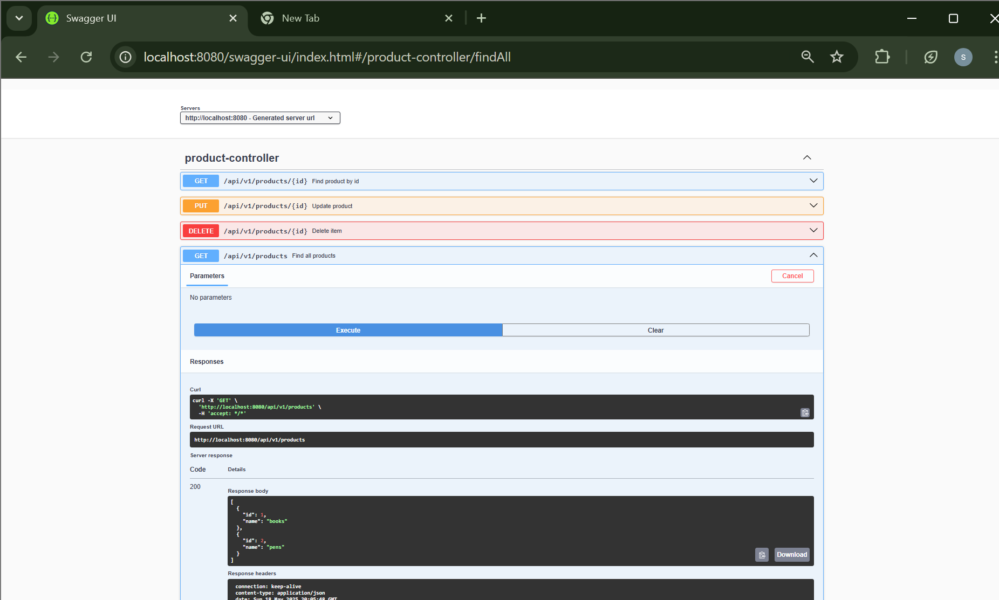
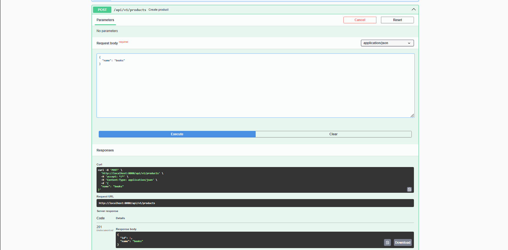
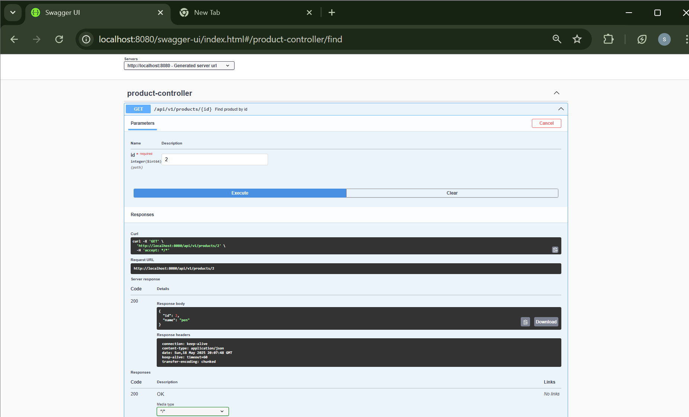
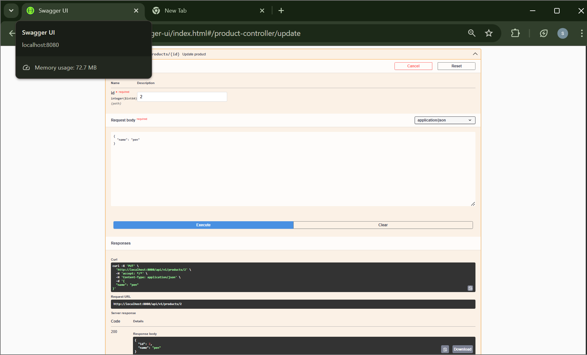
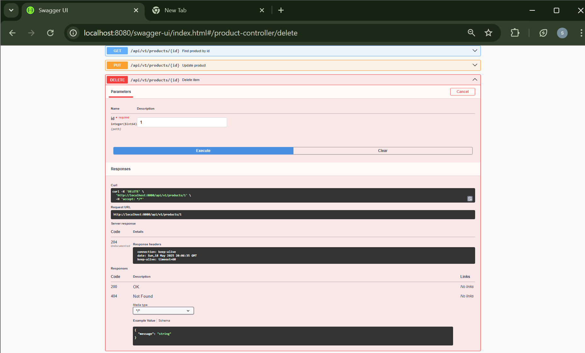

# Task 2: Building a Spring Boot REST API

A backend-only Spring Boot application designed to teach RESTful API concepts using JSON requests and responses, service layers, in-memory databases, and proper exception handling.

## Purpose

- Build a RESTful API using Spring Boot.
- Learn to structure a multi-layered application using packages for domain, service, repository, API, and support.
- Practice creating, reading, updating, and deleting (CRUD) resources.
- Add Swagger UI for easy API testing and documentation.
- Handle exceptions gracefully using `@ControllerAdvice`.

## Tools Used

- Spring Boot
- Spring Web
- Spring Data JPA
- H2 Database
- Lombok
- Swagger/OpenAPI
- IntelliJ IDEA
- Postman / Swagger UI

## Getting Started

1. Open IntelliJ IDEA
2. Select: `File` → `New` → `Project` → `Spring Initializr`
3. Add Dependencies: Spring Web, Spring Data JPA, H2 Database, Spring Boot DevTools
4. Set up project metadata (name: `FirstRestAPI`)
5. Generate the project and wait for Maven to load dependencies
6. Build the following project structure:
   - `product.api`
   - `product.domain`
   - `product.service`
   - `product.repository`
   - `product.support`
   - `product.api.request` and `product.api.response`

## Screenshots

